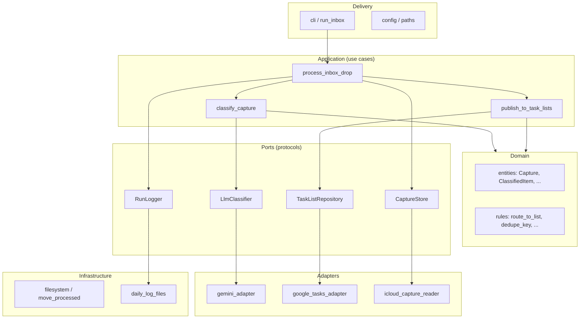

# Refactor plan: layered GTD inbox automation

This document proposes a structural refactor of **gtd-llm-assistant**. It does not change runtime behavior by itself; it defines target architecture, naming, file layout, test strategy, and LLM-oriented documentation so future edits need fewer tokens and fewer wrong assumptions.

---

## 1. Goals (constraints for the refactor)

| Principle | What it means here |
|-----------|-------------------|
| **Small, focused functions** | One decision per function; orchestration composes 3–8 line functions. |
| **Business naming** | Names reflect GTD concepts (capture, classify, route to list, dedupe) not SDK shapes (`extract_json_response`, `gcloud`). |
| **Small files** | Rough target: **&lt; 120 lines** per module; split when a file has more than one reason to change. |
| **Layered modules** | Domain → application/use-cases → ports → adapters → infrastructure (paths, iCloud, logs). |
| **Testability** | Pure domain/application code; inject ports; no tests importing `_private` helpers. |
| **LLM-oriented docs** | Module headers + `ARCHITECTURE.md` index so agents read **one map** then **one file**, not the whole tree. |

**Non-goals for this refactor:** new product features, prompt rewrites, changing GTD routing rules, or migrating off Google Tasks / Gemini.

---

## 2. Current state (as of review)

### 2.1 Layout today

```
src/
  main.py                 # entry + hardcoded iCloud paths + full pipeline loop
  inbox_json.py           # iCloud-aware JSON read (retries, copy fallback)
  icloud_download.py      # macOS PyObjC hydration
  inbox_log.py            # daily inbox run log
  gemini_log.py           # daily Gemini prompt/answer log
  adapters/
    gemini.py             # google-genai client + logging side effect
    gcloud_auth.py        # OAuth + build service
    gcloud_tasks.py       # Tasks API CRUD + pagination
  services/
    prompts.py            # large prompt strings
    gemini.py             # classification orchestration (~275 lines)
    tasks.py              # routing + idempotency + API calls (~145 lines)
    tasklists.py            # env-backed list IDs
```

`pyproject.toml` registers **both** flat top-level modules (`main`, `inbox_json`, …) and packages (`adapters`, `services`), which encourages inconsistent imports (`from inbox_json import …` vs `from services.gemini import …`).

### 2.2 What works well (keep)

- Clear **two-phase English** flow: classify type → enrich per type (`services/gemini.py`).
- **Spanish single-prompt** path when `text_es` is present.
- **Idempotency** via `inbox_hash:` marker in task notes (`services/tasks.py`).
- **iCloud hydration** separated in `icloud_download.py` with tests.
- **Thin Gemini HTTP** wrapper in `adapters/gemini.py` (except logging coupling).
- Tests exist for inbox JSON, classification helpers, task routing, and adapter body building.

### 2.3 Pain points (why refactor)

| Area | Issue | Impact |
|------|--------|--------|
| **`services/gemini.py`** | JSON parsing, language heuristics, prompt fill, normalization, English/Spanish orchestration, and **Google Tasks `list_projects`** in one module | Hard to test without mocks; violates single responsibility |
| **`services/tasks.py`** | Routing rules, dedupe scan, project merge/create, and direct adapter calls | Tests monkeypatch `tasks.create_task` instead of a port |
| **`main.py`** | Hardcoded user paths; loop mixes I/O, classification, persistence, file move | Not configurable; not unit-testable |
| **Types** | `dict[str, Any]` everywhere | No compile-time/docs contract; normalization duplicated |
| **Naming** | `gcloud_*`, `_extract_json_response`, `WORK_TL` | Agents must infer GTD meaning from technical names |
| **Logging** | `call_gemini(..., logs_dir=)` and duplicate response-text parsing (`gemini_log` vs `gemini` service) | Side effects in adapter; duplicated logic |
| **Tests** | Import `_detect_language`, `_extract_json_response`, patch module-level adapters | Brittle; break on rename/move |
| **Config** | Paths only in `main.py`; tasklist IDs in `tasklists.py` with defaults in repo | Environment-specific values in source |

---

## 3. Target architecture

### 3.1 Layer diagram



### 3.2 Dependency rule

**Dependencies point inward only:** `adapters` → `ports` ← `application` ← `delivery`. Domain has **zero** imports from adapters, SDKs, or PyObjC.

### 3.3 Proposed package layout

Use a single installable package namespace (example: `gtd_assistant`) instead of flat `src/main.py` modules.

```
src/gtd_assistant/
  ARCHITECTURE.md          # LLM index (see §7)
  __init__.py

  domain/
    __init__.py
  ARCHITECTURE.md
    capture.py             # raw inbox payload (workflow JSON)
    classified_item.py     # type, title, description, optional url/subtasks
    item_kind.py           # enum: task | project | reference | waiting_for
    language.py            # enum: en | es
    publish_result.py      # created | deduped | updated + ids

  application/
    __init__.py
  ARCHITECTURE.md
    classify_capture.py    # orchestrates EN two-phase / ES one-phase
    publish_classified_item.py
    process_inbox_run.py   # one file per use case, thin

  ports/
    __init__.py
    llm.py                 # Protocol: complete_json(prompt) -> dict
    task_lists.py          # Protocol: list_tasks, create_task, ...
    capture_reader.py      # Protocol: read_json(path) -> Capture
    run_logger.py          # Protocol: info | ok | error

  adapters/
    gemini/
      client.py            # google-genai only
      classifier.py        # implements LlmClassifier; uses prompts/
    google_tasks/
      auth.py
      repository.py        # implements TaskListRepository
    icloud/
      hydrate.py           # from icloud_download
      json_reader.py       # from inbox_json

  prompts/                 # unchanged content; not "services"
    english_classify.txt   # optional: split from prompts.py later
    ...

  infrastructure/
    config.py              # paths + env; no business rules
    inbox_run_log.py       # from inbox_log
    gemini_exchange_log.py # from gemini_log
    move_to_processed.py

  delivery/
    cli.py                 # argparse or single main(); wires defaults

tests/
  unit/domain/
  unit/application/
  unit/adapters/           # with fakes, not real API
  integration/             # optional; gated, manual
```

**Rename map (illustrative):**

| Current | Target role / name |
|---------|-------------------|
| `classify_message` | `classify_capture(capture) -> (Language, list[ClassifiedItem])` |
| `create_item_from_classification` | `publish_classified_item(drop_name, item, …) -> PublishResult` |
| `load_json_file` | `IcloudCaptureReader.read(path) -> Capture` |
| `call_gemini` | `GeminiClient.complete_json(prompt) -> raw_payload` (logging optional decorator) |
| `list_tasks` / `create_task` | methods on `TaskListRepository` |
| `WORK_TL`, … | `TaskListId.work`, … or config object `GtdLists.work` |

---

## 4. Decomposition plan (by current file)

### 4.1 `main.py` → delivery + application

**Split into:**

1. **`infrastructure/config.py`** — resolve `watch_dir`, `inbox_dir`, `processed_dir`, `logs_dir` from env (e.g. `GTD_WATCH_DIR`) with current paths as dev defaults documented in `config/env.example` only.
2. **`application/process_inbox_run.py`** — `process_all_pending_captures(config, deps)` where `deps` is a small dataclass of ports.
3. **`delivery/cli.py`** — `main()` builds real adapters + calls `process_inbox_run`.

**Functions (examples):**

- `list_pending_capture_files(watch_dir) -> list[Path]`
- `process_one_capture(path, deps) -> None` (try/except → run logger)
- `archive_capture(path, processed_dir) -> None`

`main()` should be **&lt; 25 lines**: load config, construct deps, call one application function.

### 4.2 `services/gemini.py` → domain + application + adapters

| Responsibility today | New home |
|---------------------|----------|
| Language detection | `domain/language.py` + `detect_language_from_capture(capture)` |
| Spanish type map | `domain/classified_item.py` or `domain/spanish_labels.py` |
| Normalize EN/ES items | `domain/classified_item.py` — `ClassifiedItem.from_llm_dict(...)` |
| Strip fenced JSON | `adapters/gemini/response_parser.py` — `parse_json_from_gemini_payload` |
| Prompt `{{INPUT_JSON}}` substitution | `prompts/render.py` — `render_prompt(template, capture, context)` |
| `_classify_english` / `_enrich_english` | `application/classify_capture.py` |
| `_existing_project_titles` | `application/classify_capture.py` calls **`TaskListRepository.list_project_titles(work_list)`** — not raw adapter |

**Remove** direct `from adapters.gcloud_tasks import list_projects` from classification code.

### 4.3 `services/tasks.py` → domain rules + application publish

| Piece | New home |
|-------|----------|
| `_target_tasklist` | `domain/routing.py` — `gtd_list_for(item_kind, language) -> TaskListId` |
| Idempotency hash + marker | `domain/dedupe.py` — `dedupe_marker(drop_name, item) -> str` |
| Find existing by marker | `application/publish_classified_item.py` using repository |
| Project merge / subtasks | `application/publish_classified_item.py` + `domain/project_rules.py` (e.g. default “Define next action”) |

`publish_classified_item` accepts **`TaskListRepository`**; tests use **`FakeTaskListRepository`** in memory.

### 4.4 Adapters

- **`adapters/gemini/client.py`** — API key, `generate_content`, **no** `logs_dir` parameter.
- **`adapters/gemini/logging_classifier.py`** (optional wrapper) — implements `LlmClassifier`, writes `gemini_exchange_log` before/after delegate.
- **`adapters/google_tasks/repository.py`** — move pagination helpers here; expose narrow methods used by application (avoid leaking full Google task dicts if possible: map to small `ExistingTask` / `CreatedTask` records).

### 4.5 Infrastructure modules (rename for clarity)

| Current | Proposed |
|---------|----------|
| `inbox_log.py` | `infrastructure/inbox_run_log.py` |
| `gemini_log.py` | `infrastructure/gemini_exchange_log.py` |
| `inbox_json.py` | `adapters/icloud/json_reader.py` |
| `icloud_download.py` | `adapters/icloud/hydrate.py` |

Keep macOS-only import guards in `hydrate.py`; non-Darwin remains no-op (already tested).

### 4.6 `services/prompts.py`

- Short term: move to `gtd_assistant/prompts/templates.py` (constants only).
- Optional later: one `.txt` per prompt for diff-friendly edits; `render.py` loads by name.
- Add **`prompts/README.md`** (3–5 lines): when to change classify vs enrich prompts; language split.

### 4.7 `services/tasklists.py`

- Rename to **`infrastructure/gtd_task_lists.py`** or **`config/task_lists.py`**.
- Expose a **`GtdTaskLists`** dataclass loaded once at startup (personal, work, waiting_for, reference) instead of module-level `WORK_TL` constants.
- Keeps env override behavior; removes “service layer” mislabel.

---

## 5. Domain model (minimal, high value)

Introduce **immutable dataclasses** (or `TypedDict` if staying lightweight) for the boundaries agents touch most often:

```python
# Illustrative — not implementation

@dataclass(frozen=True)
class Capture:
    raw: dict[str, Any]
    source_filename: str
    source_url: str | None

@dataclass(frozen=True)
class ClassifiedItem:
    kind: ItemKind
    title: str
    description: str
    url: str | None = None
    subtasks: tuple[str, ...] = ()
    existing_project_title: str | None = None

@dataclass(frozen=True)
class PublishResult:
    outcome: Literal["created", "deduped", "updated"]
    task_id: str
    list_id: str
    kind: ItemKind
```

**Parsing** from LLM JSON happens in **one place per language path** (`ClassifiedItem.from_spanish_llm`, `from_english_llm`), replacing scattered `_normalize_*` functions.

---

## 6. Testability strategy

### 6.1 Test pyramid

| Layer | What to test | How |
|-------|----------------|-----|
| **Domain** | Routing, dedupe marker, normalization edge cases | Pure pytest, no mocks |
| **Application** | `classify_capture`, `publish_classified_item` | Fake `LlmClassifier` returning fixture JSON; fake repository |
| **Adapters** | Response parser, task body builder, iCloud retry timing | Unit tests with mocked SDK/time (existing patterns) |
| **Delivery** | Smoke: wiring only | One test with `tmp_path` dirs and fakes |

### 6.2 Stop testing private functions

Replace tests that import `_detect_language`, `_extract_json_response`, etc. with:

- Public **`detect_language_from_capture`**
- Public **`parse_json_from_gemini_payload`**
- **`ClassifiedItem.from_*`** examples

### 6.3 Fakes (add under `tests/fakes/`)

- **`FakeLlmClassifier`** — queue of JSON responses per call (supports two-phase English).
- **`FakeTaskListRepository`** — in-memory tasks with notes markers and parent/child projects.

### 6.4 Refactor existing tests

| File | Action |
|------|--------|
| `test_gemini.py` | Target `application/classify_capture` + domain parsers; drop `_` imports |
| `test_tasks.py` | Target `publish_classified_item` + `FakeTaskListRepository`; stop patching `tasks.create_task` |
| `test_inbox_json.py` | Target `IcloudJsonCaptureReader`; keep retry/sleep tests |
| `test_gcloud_tasks.py` | Keep on adapter `build_task_body` or move to `google_tasks/models.py` |

### 6.5 `pyproject.toml` changes (when implementing)

- Single package: `packages = ["gtd_assistant"]`
- Console script: `main = "gtd_assistant.delivery.cli:main"`
- `pythonpath = ["src"]` for tests unchanged

---

## 7. LLM-oriented documentation

Goal: an agent loads **≤ 2 files** before editing a feature.

### 7.1 Repository-level `ARCHITECTURE.md` (new, ~80 lines max)

Fixed sections:

1. **Purpose** — one paragraph (GTD inbox automation).
2. **Run path** — numbered steps from watch folder → processed.
3. **Layer map** — table: layer → directory → responsibility.
4. **Key types** — `Capture`, `ClassifiedItem`, `PublishResult` with field meanings.
5. **Extension points** — “change routing → `domain/routing.py`”, “change EN classify prompt → `prompts/...`”.
6. **Secrets & logs** — env vars; never log API keys; log file names.
7. **Commands** — `uv run main`, `uv run pytest`.

### 7.2 Per-package `ARCHITECTURE.md` (~15–30 lines each)

Template for every package (`domain/`, `application/`, `ports/`, `adapters/`, …):

```markdown
# application/

**Depends on:** domain, ports only.
**Used by:** delivery.

## Files
- `classify_capture.py` — EN/ES classification use case.
- `publish_classified_item.py` — create/dedupe/update Google Tasks.

## Invariants
- Classification never writes to Tasks API.
- Publishing always applies dedupe marker before create.
```

### 7.3 Module docstrings (token-efficient)

Top of each module:

```python
"""Publish classified GTD items to Google Tasks.

Entry: publish_classified_item(...)
Port: TaskListRepository
See: application/ARCHITECTURE.md
"""
```

### 7.4 Update `AGENTS.md`

After refactor, shrink to **pointers only** (entry command, config path, link to `ARCHITECTURE.md`). Remove duplicated file-by-file lists that duplicate per-package docs.

### 7.5 Prompt for future agents (optional `.cursor/rules` or rule snippet)

- Read `ARCHITECTURE.md` before structural changes.
- Do not import adapters from `domain/` or `application/`.
- Prefer extending `Fake*` tests over live API calls.

---

## 8. Phased implementation (recommended order)

Each phase should leave **`uv run pytest`** green and behavior unchanged.

| Phase | Scope | Outcome |
|-------|--------|---------|
| **0** | Add `docs/refactor-plan.md`, root `ARCHITECTURE.md` (describing *current* code), no moves | Baseline doc for agents |
| **1** | Introduce `domain/` types + pure functions extracted from `gemini.py` / `tasks.py`; keep old modules calling new code | Tests move to public APIs |
| **2** | Introduce `ports/` protocols + `tests/fakes/`; refactor `tasks.py` to `publish_classified_item` | Application testable without monkeypatch |
| **3** | Split `gemini.py` into `application/classify_capture` + `adapters/gemini/`; inject `TaskListRepository` for project titles | Classification decoupled from Google |
| **4** | Extract `process_inbox_run` + `config`; slim `main.py` | Configurable paths |
| **5** | Rename package to `gtd_assistant`, fix `pyproject.toml` and imports | Single namespace |
| **6** | Decouple logging from `call_gemini` (wrapper); dedupe `response_text` parsing | One parser module |
| **7** | Polish: per-package `ARCHITECTURE.md`, trim `AGENTS.md`, README link to architecture | Low token onboarding |

**Estimated touch count:** ~25–35 files moved/renamed; ~15 new small files; tests updated in parallel with phases 1–3.

---

## 9. Naming conventions (project-wide)

| Avoid | Prefer | Reason |
|-------|--------|--------|
| `gcloud_*`, `gemini` in domain | `google_tasks`, `llm` in adapters only | SDK names stay at the edge |
| `_extract_json_response` | `parse_json_from_gemini_payload` | Describes business artifact |
| `data: dict` | `capture: Capture` | Typed inbox payload |
| `items` (generic) | `classified_items` | Distinguishes from API “tasks” |
| `create_item_from_classification` | `publish_classified_item` | Verb = GTD outcome |
| `WORK_TL` | `GtdTaskLists.work` | Business bucket, not abbreviation |
| `load_json_file` | `read_capture` | Intent, not format |
| `services/` | `application/` + `prompts/` | “Services” was a catch-all |

**Function size guideline:** if a function needs a comment explaining *and* another section of logic, split it.

---

## 10. Risks and mitigations

| Risk | Mitigation |
|------|------------|
| Large import churn breaks launchd / `uv run main` | Phase 5 only after re-export shim: `main.py` → `from gtd_assistant.delivery.cli import main` for one release |
| Behavior drift in normalization | Characterization tests: golden JSON fixtures for ES + EN classify/enrich outputs before/after |
| OAuth / Gemini integration regressions | No changes to auth flow in early phases; adapter tests unchanged |
| Over-splitting into too many files | Rule: new file only when it has a **named** responsibility in `ARCHITECTURE.md` |
| Domain types too heavy | Start with dataclasses; no pydantic required unless validation becomes painful |

---

## 11. Open decisions (resolve before phase 4)

1. **Config source:** env-only vs optional `~/.config/gtd-llm-assistant/config.toml` for paths.
2. **Google task shape:** keep `dict` at adapter boundary vs map to `ExistingTask` / `CreatedTask` value objects.
3. **Prompt storage:** keep Python constants vs `.txt` files (affects packaging and token count for prompt edits).
4. **Package name:** `gtd_assistant` vs `gtd_llm_assistant` (match repo name?).

---

## 12. Definition of done

The refactor is complete when:

- [ ] No module under `domain/` or `application/` imports `google.*` or `Foundation`.
- [ ] `main()` / CLI only wires config and dependencies.
- [ ] All business tests use fakes or domain pure functions; no `_*` imports in `tests/`.
- [ ] `ARCHITECTURE.md` + per-layer docs describe the system in **&lt; 200 lines total**.
- [ ] `AGENTS.md` points to architecture docs; README links to run + config only.
- [ ] Existing launchd script and env vars still work (or documented migration).

---

## 13. Quick reference: today → target flow

**Today**

```
main → load_json_file → classify_message → create_item_from_classification → shutil.move
         (icloud)         (gemini svc)         (tasks svc + gcloud_tasks)
```

**Target**

```
cli → process_inbox_run
        → capture_reader.read → Capture
        → classify_capture → list[ClassifiedItem]
        → publish_classified_item (each) → PublishResult
        → archive_capture
```

This plan is intentionally implementation-free: use the phases in §8 as PR-sized slices, each with tests and doc updates for the touched layer only.
