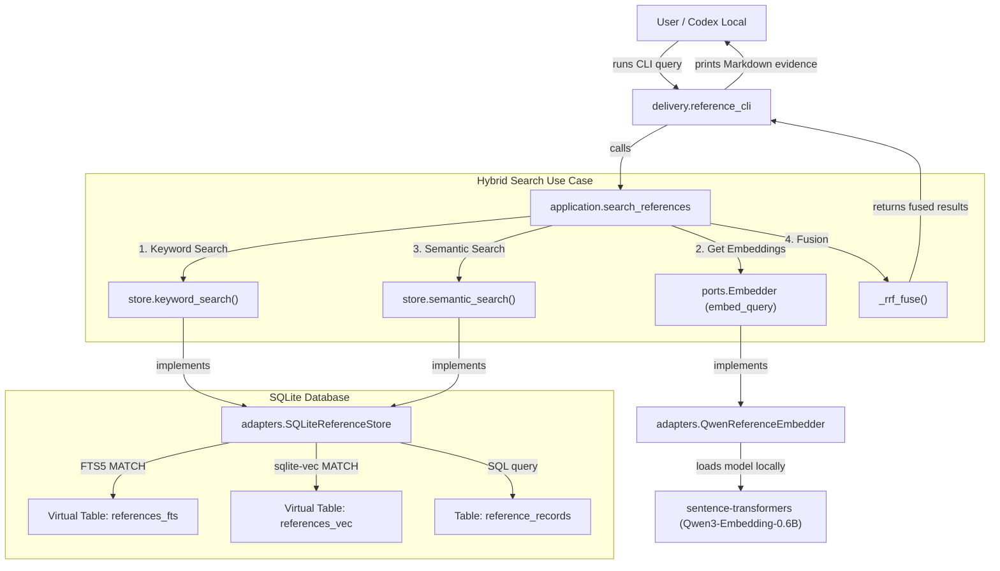

# Reference Search Architecture

This document provides a detailed explanation of how the reference documentation search works in the GTD LLM Assistant, mapping the execution flow from a user query down to the SQLite database. It covers the hybrid keyword-semantic search strategy, the technology choices made, and outlines key areas for future improvement.

---

## 1. High-Level Architecture

The reference search system is built using a clean, hexagonal architecture. This keeps the domain rules (such as search result ranking and normalization) completely decoupled from delivery mechanisms (the command-line interface) and adapters (SQLite and local machine-learning models).

---

## 2. Core Components & Responsibilities

| Component | Path | Responsibility |
|:---|:---|:---|
| **CLI Delivery** | `src/gtd_assistant/delivery/reference_cli.py` | Parsers user CLI inputs, invokes the search use case, and formats output into a clean, agent-readable Markdown report. |
| **Application Layer** | `src/gtd_assistant/application/search_references.py` | Orchestrates the hybrid search by invoking the keyword and semantic stores and fusing the results using Reciprocal Rank Fusion (RRF). |
| **Domain Layer** | `src/gtd_assistant/domain/reference.py` | Defines data shapes (`ReferenceRecord`, `NewReference`, `ReferenceSearchResult`) and pure domain rules (e.g. tag normalization, content hashing, URL normalizer). |
| **Embedder Port** | `src/gtd_assistant/ports/embedder.py` | Protocol declaring asymmetric embedding methods (`embed_documents` and `embed_query`). |
| **Qwen Embedder** | `src/gtd_assistant/adapters/qwen_embedder.py` | Concrete embedder using `sentence-transformers` to load a 600MB local weights model (`Qwen3-Embedding-0.6B`) with asymmetric instruction headers and Apple Silicon acceleration. |
| **Store Port** | `src/gtd_assistant/ports/reference_store.py` | Protocol declaring all database query and persistence signatures. |
| **SQLite Store** | `src/gtd_assistant/adapters/sqlite_reference_store/repository.py` | Direct SQLite implementation including FTS5 text matching, `sqlite-vec` binary vector operations, fallback structures, and transactional integrity. |

---

## 3. Detailed Search Pathways

### A. The Keyword Search Path (FTS5)
When keyword search is run, the query is pre-processed to prevent common query noise (like "what is a...") from degrading search relevance.

1. **Stop Word Filtering & Tokenization**:
   - The query string is parsed into alphanumeric tokens.
   - Stop words in both English and Spanish (e.g., `the`, `is`, `de`, `para`) are removed.
   - Tokens shorter than 3 characters are discarded.
2. **Wildcard Match Generation**:
   - The remaining tokens are suffixed with a wildcard star `*` and joined using `OR`. For example, a search for `"what is the docker container setup?"` becomes:
     `docker* OR container* OR setup*`
3. **SQLite FTS5 Querying**:
   - The FTS search executes a `MATCH` against `references_fts`, a virtual table indexed with the `porter unicode61` tokenizer.
   - **Relevance Scoring**: Results are ranked by SQLite's built-in BM25 score. The BM25 rank (where lower means more relevant) is normalized into a standard score from 0.0 to 1.0 using:
     $$\text{score} = \frac{1.0}{1.0 + \max(\text{rank}, 0.0)}$$
   - **Snippet Extraction**: The built-in FTS5 `snippet()` function extracts a matching segment from the document, wrapping matched words in custom brackets `[...]` for high-visibility CLI highlighting.

### B. The Semantic Vector Search Path (`sqlite-vec`)
For semantic search, the assistant uses deep learning embeddings to capture the meaning of a query rather than just exact word matches.

1. **Asymmetric Embedding Generation**:
   - Semantic retrieval is asymmetric: queries are short questions, while indexed documents are structured summaries.
   - The system utilizes the **`Qwen/Qwen3-Embedding-0.6B`** model (1024 dimensions, native float32).
   - Because it is instruct-tuned, the query is automatically pre-padded with a strict instruction prompt:
     `"Instruct: Given a search query, retrieve relevant saved references that match the query\nQuery: "`
   - Document-side embeddings (generated during ingestion) do *not* use this prefix.
2. **Apple Silicon Hardware Acceleration**:
   - The Qwen model is run in-process using `sentence-transformers` and `torch`.
   - If Apple Silicon is available, it uses the Metal Performance Shaders (`mps`) backend and loads model weights in `float16` to reduce load time and memory usage.
3. **Vector Comparison**:
   - If the `sqlite-vec` native extension is loaded, a fast float-array matching query is run directly inside SQLite against the virtual `references_vec` table.
   - If `sqlite-vec` is missing, the adapter queries all reference records and computes cosine similarities in memory using pure Python.
   - In both cases, distances are mapped to a standard similarity score.

---

## 4. Reciprocal Rank Fusion (RRF)

To achieve the best of both worlds, the system combines keyword (high-precision) and semantic (high-recall) search using **Reciprocal Rank Fusion (RRF)**. RRF does not require calibrating or normalizing the raw scores of different algorithms; instead, it uses the *relative rank* of documents within each list.

### The Algorithm
For each document $d$ in the union of keyword and semantic search results, the RRF score is calculated as:

$$RRF(d) = \frac{1}{k + r_{\text{keyword}}(d)} + \frac{1}{k + r_{\text{semantic}}(d)}$$

Where:
- $r_m(d)$ is the rank (1-indexed position) of document $d$ in search method $m$ (if $d$ is not returned by a search method, its term is omitted).
- $k$ is a constant smoothing parameter (hardcoded in the application layer as **`k = 60`** to prevent high ranks from overwhelming the fusion).

The combined results are sorted in descending order of their RRF scores, giving the assistant a highly robust top-N hybrid list where documents that rank highly in *both* lists are prioritized.

---

## 5. Ingestion & Local Document Integration

The search database is populated via two pathways:
1. **Direct Web Captures**: The inbox processor processes captures containing text/URL structures and saves them as references.
2. **Local Document Captures**: The user can drop a local file (such as `.docx`, `.md`, `.epub`, `.rtf`, `.txt`) using a macOS Shortcut or Quick Action:
   - The file's text is extracted in-process using **`pandoc`** (for rich formats) or read directly.
   - A SHA-256 hash is computed over the file's bytes and saved in `metadata.content_hash`.
   - If the document is classified as an English reference, it is embedded and saved.
   - The original file is copied into an archive folder named `${GTD_INBOX_DIR}/references/YYYY-MM-DD_<hash>_<filename>`.
   - The absolute file path is saved in the record metadata as `file_path`, allowing the query CLI to return clickable `file:///` links for the local system.

---

## 6. Major Potential Improvements

While the current system is clean, robust, and highly functional, there are several key areas that could be improved as the reference store scales.

### 1. Fix Cold-Start Latency with an Embedder Service or Fallback
* **Issue**: Loading `torch`, `sentence-transformers`, and the 600MB Qwen weights local model takes 5 to 15 seconds every time the CLI is run. For a fast terminal tool, this delay is highly noticeable.
* **Proposed Solution**: 
  - **Daemonization**: Build a lightweight background service (run via `launchd`) that keeps the embedding model hot in memory and exposes a fast unix-socket or localhost HTTP API.
  - **Gemini Embeddings Fallback**: Add an optional remote adapter that makes a fast API request to Gemini's embedding service (e.g. `text-embedding-004`) when online, bypassing local ML imports entirely.

### 2. Document Chunking & Page-Level Passage Retrieval
* **Issue**: The local document processor extracts full text and saves it to `metadata.full_text`, but embeds the document's *overall* summary as a single vector. If a document is long (e.g. a 50-page manual), the single vector loses all granular details, making it difficult to search for specific sections.
* **Proposed Solution**:
  - Implement a document chunking layer (e.g. semantic chunking or sliding window chunking with a 500-character overlap).
  - Store chunks in a child table (e.g. `reference_chunks`), embedding each chunk individually.
  - When searching, return the exact chunk/passage matching the query and link back to the parent file with a page or line-number offset.

### 3. Context-Aware Snippet Generation for Semantic Hits
* **Issue**: For FTS search hits, FTS5 automatically generates a highlighted snippet of the matching section. For semantic-only hits, however, FTS5 doesn't find a keyword match, so the CLI falls back to the first 200 characters of the summary. This fallback snippet might not contain the text that actually triggered the semantic match.
* **Proposed Solution**:
  - When a semantic search hit is returned, read its `metadata.full_text` or `summary`.
  - Use a basic Python TF-IDF or vector-distance function to identify the sentence/paragraph most similar to the user's query.
  - Extract that specific passage, highlight relevant semantic words, and display it as the snippet.

### 4. Enable Native Multi-Lingual Reference Ingestion
* **Issue**: The current system only indexes English references; Spanish captures are strictly routed to the personal task list as tasks, even if they are reference material.
* **Proposed Solution**:
  - The `Qwen3-Embedding-0.6B` model is natively highly multilingual.
  - Extend the classification prompts to allow Spanish reference routing.
  - Utilize SQLite FTS5's multi-tokenizer capabilities or configure a separate FTS column for Spanish content utilizing a Spanish stop-word filter list.

### 5. Transition to Vector HNSW Indexing
* **Issue**: `sqlite-vec`'s `references_vec` is currently queried using a brute-force flat search (K-NN), which scans every row. This works perfectly for small datasets, but does not scale linearly as thousands of documents are indexed.
* **Proposed Solution**:
  - Configure `sqlite-vec`'s HNSW (Hierarchical Navigable Small World) index support when the reference database exceeds a threshold (e.g. 5,000 records or chunks). This will maintain sub-millisecond retrieval times.
